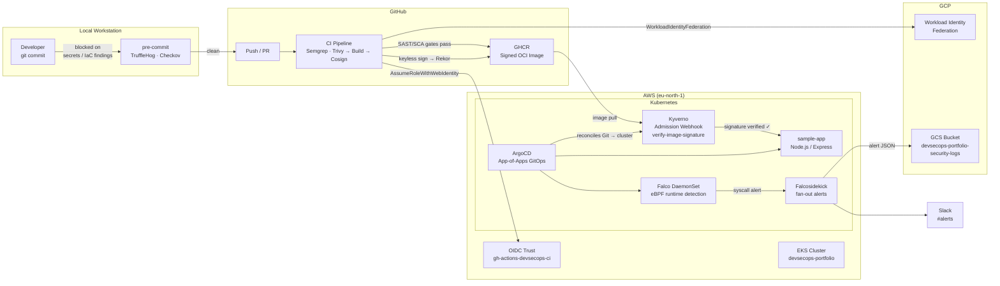

# Enterprise Multi-Cloud GitOps Pipeline with Shift-Left SecOps

[](https://github.com/EdoSag/DevSecOps-Portfolio-Project/actions/workflows/ci-build-scan-sign.yml)

A production-grade demonstration of a zero-trust, multi-cloud (AWS + GCP) GitOps pipeline where:

- Every local commit is scanned for secrets and insecure IaC (TruffleHog, Checkov)
- Every CI build is SAST- and SCA-scanned before the image is built (Semgrep, Trivy)
- Every container image is keyless-signed (Cosign/Sigstore) with a Rekor transparency log entry
- Every Kubernetes admission is verified against that signature (Kyverno)
- Every runtime anomaly is detected in-kernel (Falco eBPF) and shipped cross-cloud to Slack + GCS

---

## Architecture



---

## Technology Stack

| Layer | Tool | Version |
|---|---|---|
| IaC | OpenTofu | 1.12.1 |
| Cloud (compute) | AWS EKS | 1.31 (managed node group, t3.small × 2) |
| Cloud (storage) | GCP Cloud Storage | — |
| Identity federation | AWS IAM OIDC / GCP WIF | — |
| GitOps | ArgoCD | 2.x (Helm chart) |
| Admission control | Kyverno | 1.18.1 (chart 3.8.1) |
| Runtime detection | Falco | 0.44.1 (chart 9.1.0) |
| Alert fan-out | Falcosidekick | 2.32.0 |
| SAST | Semgrep | `p/javascript`, `p/security-audit` |
| SCA | Trivy | aquasecurity/trivy-action@v0.36.0 |
| Image signing | Cosign | v2.4.1 (keyless / Sigstore) |
| Secret scanning | TruffleHog | v3.95.5 |
| IaC scanning | Checkov | 3.3.0 |

---

## Phase 0 — Local Tooling

Install prerequisites (Windows, winget):

```powershell
winget install -e --id OpenTofu.Tofu
winget install -e --id Amazon.AWSCLI
winget install -e --id Google.CloudSDK
winget install -e --id Kubernetes.kubectl
winget install -e --id Helm.Helm
winget install -e --id Docker.DockerDesktop
winget install -e --id Sigstore.Cosign
winget install -e --id GitHub.cli
winget install -e --id OpenJS.NodeJS.LTS
pip install --user pre-commit
```

Configure credentials:

```bash
aws configure                        # sets default region to eu-north-1
gcloud auth login
gcloud config set project devsecops-portfolio
```

---

## Phase 1 — Shift-Left Local Gates

Install pre-commit hooks:

```bash
pre-commit install
```

### TruffleHog — secret scan (blocks commit)

`app/src/config.js` originally contained a syntactically-valid fake AWS access key (`AKIAFAKEKEY1234EXAMP`). Attempting to commit produced:

```
TruffleHog (secret scan)...Failed
Found verified result 🐷🔑
Detector Type: AWS
Raw result: AKIAFAKEKEY1234EXAMP
```

The key was moved to an environment variable (`AWS_ACCESS_KEY_ID`), `.env.example` was added, and the commit succeeded.

### Checkov — IaC scan (blocks commit)

A deliberately insecure security group (`0.0.0.0/0` port 22 ingress) was placed in `infra/` and triggered:

```
Check: CKV_AWS_25: "Ensure no security groups allow ingress from 0.0.0.0:0 to port 22"
FAILED for resource: aws_security_group.bad
```

The resource was removed and the commit succeeded.

---

## Phase 2 — Multi-Cloud Foundation & OIDC

All IaC is in `infra/`. State is local (no remote backend — noted as stretch goal).

```bash
# AWS OIDC trust + IAM role
cd infra/bootstrap/aws-oidc && tofu init && tofu apply

# GCP Workload Identity Federation + service account
cd infra/bootstrap/gcp-oidc && tofu init && tofu apply

# GCS security-logs bucket (versioning + retention)
cd infra/gcp-storage && tofu init && tofu apply

# EKS cluster (~$6-8/day while running)
cd infra/aws-eks && tofu init && tofu apply

# Update kubeconfig
aws eks update-kubeconfig --name devsecops-portfolio --region eu-north-1
kubectl get nodes
```

Key resources provisioned:
- IAM role `gh-actions-devsecops-ci` (OIDC trust, `sub: repo:EdoSag/DevSecOps-Portfolio-Project:*`)
- GCP WIF pool `github-actions-pool`, SA `gh-actions-ci@devsecops-portfolio.iam.gserviceaccount.com`
- GCS bucket `devsecops-portfolio-security-logs` (versioning enabled, uniform bucket-level access)
- EKS cluster `devsecops-portfolio` (eu-north-1, 2× t3.small managed nodes)

> **NAT Gateway required:** Kyverno's `verifyImages` admission webhook calls the public Rekor transparency log (`rekor.sigstore.dev`) from private worker nodes. Removing the NAT gateway breaks the webhook and blocks all Pod admission.

---

## Phase 3 — CI Pipeline: Catch, Fix, Sign

Pipeline: [`.github/workflows/ci-build-scan-sign.yml`](.github/workflows/ci-build-scan-sign.yml)

Jobs run in sequence: `sast` + `sca-deps` → `build-and-push` → `sca-image` → `sign`

### Before: gates fail on the vulnerable app

**Semgrep** caught the SQL injection in the original `/search` handler:

```
app/src/app.js:24: sql-injection
  db.all(`SELECT * FROM users WHERE name = '${name}'`, ...)
  Severity: ERROR  CWE-89
```

**Trivy** caught the vulnerable JWT library:

```
jsonwebtoken 8.5.1
  CVE-2022-23529  HIGH   Unrestricted key type could lead to ...
  CVE-2022-23540  HIGH   Insecure implementation of key retrieval ...
```

Both failures blocked the build — no image was pushed.

### After: remediation

| Finding | Fix |
|---|---|
| SQLi (`db.all(\`...${name}\`)`) | Parameterized query: `db.all('SELECT ... WHERE name = ?', [name])` |
| `jsonwebtoken@8.5.1` CVEs | Bumped to `jsonwebtoken@^9.0.2` |
| `sqlite3` GLIBC_2.38 crash | `npm_config_build_from_source=true npm ci` in build stage (Dockerfile) |

After remediation the pipeline went green: Semgrep passes, Trivy passes, image pushed to GHCR, image Trivy-scanned, image signed with Cosign v2.4.1 (keyless/Sigstore).

### Verify the signature locally

```bash
cosign verify \
  --certificate-identity-regexp "^https://github\.com/EdoSag/DevSecOps-Portfolio-Project/\.github/workflows/.+@refs/heads/main$" \
  --certificate-oidc-issuer https://token.actions.githubusercontent.com \
  ghcr.io/edosag/devsecops-portfolio-project@sha256:e225fb9c359581d45706ad4364d7b96f1e70c87615c7a81a26ac39c3712fc939
```

Expected output:

```
Verification for ghcr.io/edosag/devsecops-portfolio-project@sha256:e225fb9... --
The following checks were performed on each of these signatures:
  - The cosign claims were validated
  - Existence of the claims in the transparency log was verified offline
  - The code-signing certificate claims were validated

[{"critical":{"identity":{"docker-reference":"ghcr.io/edosag/devsecops-portfolio-project"},
  "image":{"docker-manifest-digest":"sha256:e225fb9c..."},"type":"cosign container image signature"},
  "optional":{"Bundle":{"SignedEntryTimestamp":"...","Payload":{"rekorLogIndex":...}}}}]
```

> **cosign v2.4.1 pinned in CI:** cosign v3.x switched to OCI 1.1 referrers-fallback tags (`sha256-<digest>` without `.sig` suffix). Kyverno 1.18.1 (bundling cosign v3.0.6) only discovers the legacy `sha256-<digest>.sig` tag format. Pinning CI to v2.4.1 ensures Kyverno can find the signature.

---

## Phase 4 — GitOps & Admission Control

### Bootstrap ArgoCD

```bash
kubectl create namespace argocd
helm repo add argo https://argoproj.github.io/argo-helm
helm install argocd argo/argo-cd -n argocd

# Get admin password
kubectl -n argocd get secret argocd-initial-admin-secret \
  -o jsonpath='{.data.password}' | base64 -d

# Port-forward the UI
kubectl port-forward svc/argocd-server -n argocd 8080:443
```

### Deploy the app-of-apps

```bash
kubectl apply -f k8s-manifests/argocd/root-app.yaml
```

This creates a root ArgoCD Application that watches `k8s-manifests/argocd/apps/`, which in turn reconciles:

| App | Chart / Path | Namespace |
|---|---|---|
| `kyverno` | `kyverno/kyverno` 3.8.1 | `kyverno` |
| `policies` | `k8s-manifests/kyverno/policies/` | cluster-scoped |
| `falco` | `falcosecurity/falco` 9.1.0 | `falco` |
| `sample-app` | `k8s-manifests/sample-app/` | `default` |

> **ServerSideApply required for Kyverno:** The Kyverno CRDs (`clusterpolicies.kyverno.io`, `policies.kyverno.io`) exceed the 256 KB annotation limit for client-side apply. `syncOptions: [ServerSideApply=true]` bypasses this limit.

### Kyverno ClusterPolicy

[`k8s-manifests/kyverno/policies/verify-image-signature.yaml`](k8s-manifests/kyverno/policies/verify-image-signature.yaml)

- `validationFailureAction: Enforce` — admission denied if verification fails
- `failurePolicy: Fail` — webhook failure is treated as rejection, not pass-through
- `webhookTimeoutSeconds: 30` — allows time for Rekor TLS lookup on cold start

### Signed image deploys; unsigned image is rejected

```bash
# Signed image: runs successfully
kubectl get pod -l app=sample-app
# NAME                          READY   STATUS    RESTARTS
# sample-app-584567fbd5-9qbkh   1/1     Running   0

# Unsigned image: rejected at admission
kubectl run unsigned-test --image=nginx:latest
# Error from server: admission webhook "mutate.kyverno.svc-fail" denied the request:
# resource Pod was blocked due to the following policies
# verify-image-signature:
#   verify-devsecops-portfolio-image: image verification failed for
#   ghcr.io/library/nginx:latest: no matching signatures found
```

```bash
# Confirm policy is Ready
kubectl get clusterpolicy verify-image-signature
# NAME                      ADMISSION   BACKGROUND   VALIDATE ACTION   READY   AGE
# verify-image-signature    true        false        Enforce           True    ...
```

---

## Phase 5 — Runtime Detection & Incident Response

### Architecture

Falco runs as a DaemonSet on each node using the **modern eBPF** driver (no kernel headers required on EKS managed nodes). On a security event Falco emits a structured JSON event to Falcosidekick, which fans out to Slack and GCS.

### Pre-create credentials secret (not committed)

```bash
# Encode the GCP service-account key as base64
GCP_B64=$(base64 -w0 < falco-gcs-writer-key.json)

kubectl -n falco create secret generic falco-sidekick-config \
  --from-literal=SLACK_WEBHOOKURL=https://hooks.slack.com/services/... \
  --from-literal=SLACK_MINIMUMPRIORITY=warning \
  --from-literal=GCP_CREDENTIALS="${GCP_B64}" \
  --from-literal=GCP_STORAGE_BUCKET=devsecops-portfolio-security-logs \
  --from-literal=GCP_STORAGE_PREFIX=falco-alerts \
  --from-literal=GCP_STORAGE_MINIMUMPRIORITY=warning
```

> `falcosidekick.config.existingSecret` appends the secret to `envFrom` *after* the chart-created secret, so its values override the chart's empty defaults.

### Breach simulation

The sample-app uses a distroless image (no shell). Use an ephemeral debug container to share its process namespace:

```bash
kubectl debug -it sample-app-584567fbd5-9qbkh \
  --image=ubuntu:22.04 \
  --target=sample-app
```

Inside the ephemeral container, simulate attacker actions:

```bash
# Triggers "Read sensitive file untrusted" (MITRE T1555 - Credentials from Password Stores)
cat /etc/shadow

# Triggers "Write below binary dir" (MITRE T1222)
echo "x" >> /usr/bin/pwned
```

### Confirmed alerts

**Slack** (Falcosidekick log):
```
Slack - POST OK (200)
```

**GCS** (Falcosidekick log):
```
GCPStorage - Upload to bucket OK
```

**Alert JSON retrieved from GCS:**
```bash
gcloud storage ls gs://devsecops-portfolio-security-logs/falco-alerts/2026-06-16/
# gs://devsecops-portfolio-security-logs/falco-alerts/2026-06-16/2026-06-16T06:45:48.628423192Z.json
```

```json
{
  "output": "...: Sensitive file opened for reading by non-trusted program (file=/etc/shadow ...)",
  "priority": "Warning",
  "rule": "Read sensitive file untrusted",
  "source": "syscall",
  "tags": ["T1555", "container", "filesystem", "host", "mitre_credential_access"],
  "time": "2026-06-16T06:45:48.628423192Z",
  "output_fields": {
    "container.id": "...",
    "container.name": "debugger-ftlls",
    "fd.name": "/etc/shadow",
    "k8s.ns.name": "default",
    "k8s.pod.name": "sample-app-584567fbd5-9qbkh",
    "proc.name": "cat"
  }
}
```

### Incident response playbook

1. **Alert fires in Slack** — rule name, pod, namespace, process, file path
2. **Pull the full event from GCS** — `gcloud storage cp gs://devsecops-portfolio-security-logs/falco-alerts/YYYY-MM-DD/<timestamp>.json .`
3. **Isolate the pod** — apply a `NetworkPolicy` deny-all or delete the pod (ArgoCD self-heals it, so delete the Deployment if containment is needed)
4. **Inspect the ephemeral container logs** — `kubectl logs <pod> -c <debug-container>`
5. **Review Rekor for the image's signing event** — `cosign verify` confirms the last legitimate build
6. **Remediate** — patch the workload, cut a new signed image through CI, ArgoCD rolls it out

---

## Phase 6 — Documentation

This README is Phase 6.

---

## Phase 7 — Teardown

Run in order to avoid orphaned billable resources:

```bash
# 1. Remove k8s workloads (avoids orphaned LoadBalancers — none in this project, but good practice)
kubectl delete -f k8s-manifests/argocd/root-app.yaml
kubectl -n argocd delete applications --all

# 2. Destroy EKS + VPC (~$6-8/day cost driver)
cd infra/aws-eks
tofu plan -destroy   # review first
tofu destroy

# 3. Verify no orphaned resources
aws ec2 describe-nat-gateways --filter Name=state,Values=available
aws ec2 describe-volumes --filters Name=status,Values=available
aws eks list-clusters

# 4. GCS bucket — retains security-log evidence; destroy only if no longer needed
#    Retention policy blocks object deletion until the policy period elapses.
#    To force-destroy: set force_destroy = true in infra/gcp-storage/main.tf, tofu apply, then tofu destroy.
cd infra/gcp-storage
# tofu destroy   # optional

# 5. OIDC bootstrap resources (free — can stay as permanent trust anchors)
# cd infra/bootstrap/aws-oidc && tofu destroy   # optional
# cd infra/bootstrap/gcp-oidc && tofu destroy   # optional
```

---

## Key Lessons & Non-Obvious Gotchas

| Gotcha | Resolution |
|---|---|
| Kyverno CRDs > 256 KB annotation limit block client-side `kubectl apply` | `syncOptions: [ServerSideApply=true]` in the ArgoCD Application |
| `sqlite3@6.0.1` prebuilt binary requires GLIBC 2.38; Debian 12 bookworm provides 2.36 | `npm_config_build_from_source=true npm ci` in the Dockerfile build stage |
| cosign v3.x writes OCI 1.1 referrers-fallback tags (no `.sig` suffix); Kyverno 1.18.1 only finds the legacy `.sig` tag | Pin CI to `cosign-release: v2.4.1` in the sign step |
| Kyverno's `verifyImages` calls `rekor.sigstore.dev` from private worker nodes | NAT Gateway must remain enabled; removing it causes webhook timeout → all Pod admission denied |
| Falcosidekick `extraEnv` does not reach the pod (chart uses `envFrom`, not `env:`) | Use `falcosidekick.config.existingSecret` — the chart appends the secret to `envFrom` after its own, so credentials override the empty defaults |
| `kubectl debug --target=app` fails on distroless pods (container name is not `app`) | Use `--target=<actual-container-name>` — inspect with `kubectl get pod -o jsonpath='{.spec.containers[*].name}'` |
| Kyverno rejects ClusterPolicy without `rekor.url` ("Either Rekor URL or roots are required") | Keep `rekor: url: https://rekor.sigstore.dev` in the keyless attestor block |

---

## Repository Structure

```
├── .github/workflows/
│   ├── ci-build-scan-sign.yml   # SAST → SCA → Build → Sign
│   └── terraform-plan.yml
├── .pre-commit-config.yaml       # TruffleHog + Checkov
├── app/
│   ├── src/
│   │   ├── index.js
│   │   ├── app.js               # Express routes (parameterized SQL, JWT)
│   │   └── config.js
│   ├── Dockerfile               # multi-stage, distroless runtime
│   └── package.json
├── infra/
│   ├── bootstrap/
│   │   ├── aws-oidc/            # IAM OIDC provider + gh-actions role
│   │   └── gcp-oidc/            # WIF pool + provider + service account
│   ├── aws-eks/                 # VPC + EKS + managed node group
│   └── gcp-storage/             # GCS security-logs bucket
└── k8s-manifests/
    ├── argocd/
    │   ├── root-app.yaml
    │   └── apps/                # kyverno, falco, policies, sample-app Applications
    ├── kyverno/
    │   ├── helm-values.yaml
    │   └── policies/verify-image-signature.yaml
    ├── falco/
    │   └── helm-values.yaml     # modern_ebpf, existingSecret for credentials
    └── sample-app/
        ├── deployment.yaml      # pinned to signed digest
        └── service.yaml
```
